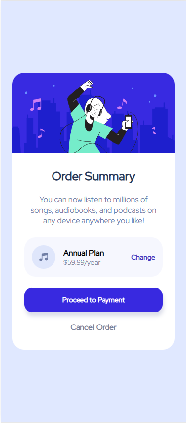

# Frontend Mentor - Order summary card solution

This is a solution to the [Order summary card challenge on Frontend Mentor](https://www.frontendmentor.io/challenges/order-summary-component-QlPmajDUj). Frontend Mentor challenges help you improve your coding skills by building realistic projects. 

## Table of contents

- [Overview](#overview)
  - [The challenge](#the-challenge)
  - [Screenshot](#screenshot)
  - [Links](#links)
- [My process](#my-process)
  - [Built with](#built-with)
  - [Continued development](#continued-development)
- [Author](#author)

## Overview

### The challenge

Users should be able to:

- See hover states for interactive elements

### Screenshot

### Links

- Solution URL: [Add solution URL here](https://your-solution-url.com)
- Live Site URL: [Add live site URL here](https://your-live-site-url.com)

## My process

- Firstly intialize the repository(I forgot to do that this time!)
- Set up the css file with boilerplate code and root properties and link it with the html code
- Write out the layout for all the html elements and classnames
- Firstly set up the flexboxes so that they layout the content similar to the designs
- Check on the changing the direction of the flexboxes with a change in screen size for desktop version
- Style all the elements
- Ensure styles matches with desktop (This time only a small media query was needed!)
- Set up the interactive hover elements

### Built with

- Semantic HTML5 markup
- CSS custom properties
- Flexbox
- Mobile-first workflow
- Box shadow
- Media queries

### Continued development

- Mobile first workflow
- Responsive design with media queries
- Using appropriate units for sizes

## Author

- Frontend Mentor - [@MoggStephen](https://www.frontendmentor.io/profile/MoggStephen)